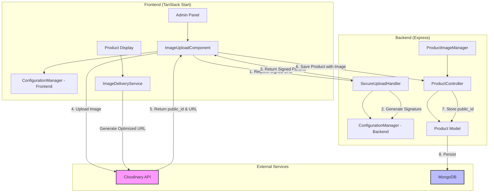
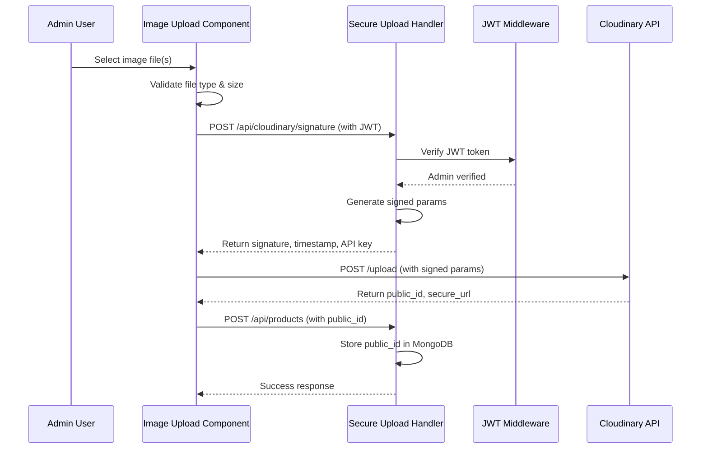

# Design Document: Cloudinary Image Storage Integration

## Overview

This document defines the technical design for integrating Cloudinary cloud storage into the Garima Fashion e-commerce application to replace the current local file storage (multer-based uploads) with a scalable, cloud-based image management solution.

### Current System

The application currently:
- Uses `multer` middleware in Express backend to handle file uploads to local `/uploads/` directory
- Stores image URLs as strings in MongoDB Product model's `images` array field
- Serves images as static files from the Express server
- Uses ImageKit for some frontend image display (to be migrated)

### Target System

The new Cloudinary-based system will:
- Upload images directly to Cloudinary cloud storage from the frontend
- Generate signed upload URLs from the backend for security
- Store Cloudinary public IDs and secure URLs in MongoDB
- Serve optimized, transformed images via Cloudinary's CDN
- Support automatic format conversion and responsive image delivery

### Technology Stack

**Frontend:**
- TanStack Start (React 19)
- Cloudinary SDK (`cloudinary-core` or `@cloudinary/url-gen`)
- Fetch API for backend communication

**Backend:**
- Node.js + Express 5
- Cloudinary Node.js SDK (`cloudinary`)
- MongoDB + Mongoose for data persistence
- JWT authentication for admin operations

## Architecture

### System Components



### Authentication Flow



### Upload Flow Architecture

**Client-Side Upload Pattern:**
The design uses a client-side upload pattern where:
1. Frontend requests signed upload parameters from backend
2. Frontend uploads directly to Cloudinary (no image data passes through backend)
3. Frontend sends only the Cloudinary public ID to backend for storage

This approach:
- Reduces backend bandwidth and processing
- Leverages Cloudinary's CDN for faster uploads
- Maintains security through signed requests

## Components and Interfaces

### 1. Configuration Manager (Backend)

**Location:** `backend/config/cloudinary.js` (new file)

**Purpose:** Initialize and configure Cloudinary SDK with environment variables

**Interface:**
```typescript
interface CloudinaryConfig {
  cloud_name: string;
  api_key: string;
  api_secret: string;
}

function initializeCloudinary(): void;
function getCloudinaryInstance(): typeof cloudinary;
function validateConfiguration(): { valid: boolean; errors: string[] };
```

**Implementation Details:**
- Load credentials from environment variables on server startup
- Throw error and prevent startup if any required variable is missing/empty
- Export configured Cloudinary instance for use in other modules
- Use `cloudinary.config()` method from Node.js SDK

**Dependencies:**
- `cloudinary` npm package (v1.x or v2.x)
- `dotenv` for environment variable loading

### 2. Secure Upload Handler (Backend)

**Location:** `backend/routes/cloudinary.js` (new file) + `backend/controllers/cloudinaryController.js` (new file)

**Purpose:** Generate signed upload parameters for secure frontend uploads

**Endpoint:**
```
POST /api/cloudinary/signature
Headers:
  Authorization: Bearer <admin_jwt_token>
Response: {
  signature: string,
  timestamp: number,
  api_key: string,
  cloud_name: string,
  folder: string
}
```

**Implementation Details:**
- Verify JWT token and admin privileges using existing auth middleware
- Generate timestamp (Unix seconds)
- Create signature using `cloudinary.utils.api_sign_request()`
- Set upload folder to "garima-fashion/products"
- Set expiration to 3600 seconds (1 hour)
- Return all parameters needed for frontend upload

**Security Considerations:**
- Never expose `api_secret` to frontend
- Signature includes timestamp to prevent replay attacks
- Folder path restricts upload location
- JWT verification ensures only authenticated admins can request signatures

### 3. Image Upload Component (Frontend)

**Location:** `src/components/admin/ImageUpload.tsx` (new component)

**Purpose:** Handle image file selection, validation, and upload to Cloudinary

**Props Interface:**
```typescript
interface ImageUploadProps {
  onUploadComplete: (publicIds: string[], secureUrls: string[]) => void;
  onUploadError: (error: string) => void;
  maxImages?: number;  // default: 10
  existingImages?: Array<{ publicId: string; secureUrl: string }>;
}
```

**Component State:**
```typescript
interface ImageUploadState {
  selectedFiles: File[];
  previews: string[];
  uploading: boolean;
  progress: number[];  // Upload progress for each file
  errors: string[];
}
```

**Implementation Details:**
- Validate file extensions: `.jpg, .jpeg, .png, .webp, .gif` (case-insensitive)
- Validate MIME types: `image/jpeg, image/png, image/webp, image/gif`
- Validate file size: max 10 MB (10,485,760 bytes) per file
- Generate local preview URLs using `URL.createObjectURL()`
- Request signed upload parameters from backend
- Upload each file to Cloudinary using `fetch()` with `multipart/form-data`
- Track upload progress using `XMLHttpRequest` or Progress API
- Handle timeout (10s for signature request, 60s for upload)
- Extract `public_id` and `secure_url` from Cloudinary response
- Call `onUploadComplete` callback with all public IDs and URLs

**Error Handling:**
- Display user-friendly error messages
- Provide retry mechanism for failed uploads
- Show progress indicators during upload
- Clean up preview URLs on unmount to prevent memory leaks

### 4. Product Image Manager (Backend)

**Location:** `backend/controllers/productController.js` (modifications to existing)

**Purpose:** Manage product-image associations in MongoDB

**Modified Functions:**

```typescript
// Modified createProduct
async function createProduct(req: Request, res: Response): Promise<void> {
  // Extract publicIds from req.body.images (array of strings)
  // Validate publicId format: alphanumeric with slashes and hyphens
  // Limit to maximum 10 images
  // Store array of publicIds in Product.images field
  // Generate secure URLs using Image Delivery Service
}

// Modified updateProduct  
async function updateProduct(req: Request, res: Response): Promise<void> {
  // If req.body.images provided, replace existing images
  // Validate new publicIds
  // Update Product.images array
}

// Remove getImageUrls helper (no longer needed for multer)
```

**Validation Rules:**
- Public ID format: `^[a-zA-Z0-9/_-]+$`
- Maximum 10 images per product
- Empty array allowed (product with no images)
- Reject invalid format with descriptive error message

**MongoDB Schema Changes:**
```javascript
// Product model - images field remains array of strings
// But now stores Cloudinary public IDs instead of local file paths
images: {
  type: [String],
  default: [],
  validate: {
    validator: function(arr) {
      return arr.length <= 10;
    },
    message: 'Maximum 10 images allowed per product'
  }
}
```

### 5. Image Delivery Service (Frontend)

**Location:** `src/lib/cloudinary.ts` (new file)

**Purpose:** Generate optimized image URLs with transformations

**Interface:**
```typescript
type ImageContext = 'thumbnail' | 'product-detail' | 'gallery';

interface TransformationOptions {
  width?: number;
  height?: number;
  crop?: 'fill' | 'fit' | 'scale' | 'crop';
  quality?: 'auto' | number;
  format?: 'auto' | 'jpg' | 'png' | 'webp';
}

function generateImageUrl(
  publicId: string,
  context: ImageContext
): string;

function generateImageUrlWithOptions(
  publicId: string,
  options: TransformationOptions
): string;

function getPlaceholderUrl(): string;
```

**Transformation Presets:**
```typescript
const TRANSFORMATIONS: Record<ImageContext, TransformationOptions> = {
  'thumbnail': {
    width: 300,
    height: 300,
    crop: 'fill',
    quality: 'auto',
    format: 'auto'
  },
  'product-detail': {
    width: 800,
    quality: 'auto',
    format: 'auto'
  },
  'gallery': {
    width: 1200,
    quality: 'auto',
    format: 'auto'
  }
};
```

**Implementation Details:**
- Use Cloudinary URL structure: `https://res.cloudinary.com/{cloud_name}/image/upload/{transformations}/{publicId}`
- Build transformation string from options: `w_300,h_300,c_fill,q_auto,f_auto`
- Return placeholder URL for null/empty public IDs
- Performance target: <10ms per URL generation (pure string manipulation)
- No external API calls (URL construction only)

**Example URLs:**
```
// Thumbnail
https://res.cloudinary.com/demo/image/upload/w_300,h_300,c_fill,q_auto,f_auto/garima-fashion/products/saree-001.jpg

// Product Detail
https://res.cloudinary.com/demo/image/upload/w_800,q_auto,f_auto/garima-fashion/products/saree-001.jpg

// Gallery
https://res.cloudinary.com/demo/image/upload/w_1200,q_auto,f_auto/garima-fashion/products/saree-001.jpg
```

### 6. Image Deletion Service (Backend)

**Location:** `backend/controllers/cloudinaryController.js` (new function)

**Purpose:** Delete images from Cloudinary and remove references from database

**Endpoint:**
```
DELETE /api/cloudinary/images/:publicId
Headers:
  Authorization: Bearer <admin_jwt_token>
Response: {
  success: boolean,
  message: string
}
```

**Implementation Logic:**
```typescript
async function deleteImage(req: Request, res: Response): Promise<void> {
  // 1. Verify admin JWT token
  // 2. Extract publicId from URL params
  // 3. Check if image is referenced in any Product documents
  // 4. If still in use, return error 400
  // 5. Call cloudinary.uploader.destroy(publicId)
  // 6. If Cloudinary deletion succeeds, return success
  // 7. If Cloudinary deletion fails, return error (don't remove from DB)
}
```

**Safety Measures:**
- Prevent deletion of images still associated with products
- Use MongoDB query to check references: `Product.find({ images: publicId })`
- Atomic operation: only succeed if both Cloudinary and DB operations succeed
- Timeout: 30 seconds for Cloudinary API call

## Data Models

### Product Model Changes

**Current Schema:**
```javascript
{
  images: {
    type: [String],
    default: []
  }
}
```

**Updated Schema (conceptual - field type stays same):**
```javascript
{
  images: {
    type: [String],  // Now stores Cloudinary public IDs instead of local URLs
    default: [],
    validate: {
      validator: function(arr) {
        return arr.length <= 10;
      },
      message: 'Maximum 10 images allowed per product'
    }
  }
}
```

**Data Migration Considerations:**
- Existing products have local file URLs: `/uploads/filename.jpg`
- After migration, products will have Cloudinary public IDs: `garima-fashion/products/filename`
- During transition, system should handle both formats
- Add detection logic in `normalizeImageUrl()` function to identify ImageKit or local URLs and log warnings

### Cloudinary Image Metadata (stored in Cloudinary, not MongoDB)

Cloudinary automatically stores metadata for each uploaded image:
```json
{
  "public_id": "garima-fashion/products/saree-001",
  "format": "jpg",
  "width": 2000,
  "height": 3000,
  "bytes": 450000,
  "created_at": "2024-01-15T10:30:00Z",
  "folder": "garima-fashion/products"
}
```

This metadata is accessible via Cloudinary Admin API but not stored in MongoDB.

## Correctness Properties

*A property is a characteristic or behavior that should hold true across all valid executions of a system—essentially, a formal statement about what the system should do. Properties serve as the bridge between human-readable specifications and machine-verifiable correctness guarantees.*

Before defining properties, I'll analyze each acceptance criterion for testability:


### Property 1: Environment Variable Validation Prevents Startup

*For any* required environment variable (CLOUDINARY_CLOUD_NAME, CLOUDINARY_API_KEY, CLOUDINARY_API_SECRET), if the variable is missing, empty, or contains only whitespace characters, the Configuration Manager SHALL prevent application startup and log an appropriate error message.

**Validates: Requirements 1.4, 1.5, 1.6**

### Property 2: File Extension and MIME Type Validation

*For any* file submitted for upload, the Image Upload Component SHALL accept the file only if it has both a valid extension (.jpg, .jpeg, .png, .webp, .gif - case insensitive) AND a valid MIME type (image/jpeg, image/png, image/webp, image/gif).

**Validates: Requirements 2.1**

### Property 3: File Size Validation

*For any* file submitted for upload, the Image Upload Component SHALL reject files with size exceeding 10,485,760 bytes (10 MiB).

**Validates: Requirements 2.2**

### Property 4: Administrator Authorization for Signature Requests

*For any* request to the Secure Upload Handler, the handler SHALL verify administrator privileges and return HTTP 403 Forbidden if the requesting user is not authenticated or lacks administrator privileges.

**Validates: Requirements 3.1, 3.2, 6.1, 6.2**

### Property 5: Signature Generation Parameters

*For any* authenticated administrator request, when the Secure Upload Handler generates a signed upload signature, the signature SHALL include a timestamp with 3600 second expiration and SHALL specify the upload folder as "garima-fashion/products".

**Validates: Requirements 3.4, 3.5**

### Property 6: Image Association Storage and Retrieval Round-Trip

*For any* product created or updated with Cloudinary public IDs, when the product is stored with images in a specified order and subsequently retrieved, the Product Catalog SHALL return all image public IDs in the same order they were provided.

**Validates: Requirements 4.1, 4.2, 4.3, 4.5**

### Property 7: Product Image Replacement on Update

*For any* existing product, when updated with a new set of Cloudinary public IDs, the Product Image Manager SHALL replace all existing image references with the new public IDs, discarding the previous image list entirely.

**Validates: Requirements 4.4**

### Property 8: Public ID Format Validation

*For any* Cloudinary public ID provided during product creation or update, if the public ID does not match the expected format (alphanumeric characters with forward slashes and hyphens), the Product Image Manager SHALL reject the request and return an error message.

**Validates: Requirements 4.7**

### Property 9: Context-Specific Image Transformation URLs

*For any* valid Cloudinary public ID and display context (thumbnail, product-detail, or gallery), the Image Delivery Service SHALL generate a URL containing the correct transformation parameters for that context: thumbnail (w_300,h_300,c_fill,q_auto,f_auto), product-detail (w_800,q_auto,f_auto), or gallery (w_1200,q_auto,f_auto).

**Validates: Requirements 5.1, 5.2, 5.3, 5.4, 5.5**

### Property 10: URL Generation Performance

*For any* Cloudinary public ID and transformation parameters, the Image Delivery Service SHALL complete URL generation within 10 milliseconds.

**Validates: Requirements 5.6, 9.1**

### Property 11: Image Deletion Safety Check

*For any* image deletion request, if the image public ID is still referenced by one or more product records in the Product Catalog, the Product Image Manager SHALL prevent deletion and return an error message indicating the image is still in use.

**Validates: Requirements 6.4**

### Property 12: Atomic Deletion Operation

*For any* image deletion request for an unused image, if the Cloudinary deletion operation fails for any reason, the Product Image Manager SHALL NOT remove the image reference from the Product Catalog and SHALL return an error message.

**Validates: Requirements 6.9**

### Property 13: ImageKit URL Detection

*For any* product record processed during application operations, if the product contains an image URL with the domain "ik.imagekit.io", the Product Image Manager SHALL log a warning message containing the product ID and the detected ImageKit URL.

**Validates: Requirements 7.6**

### Property 14: Network Error Retry Logic

*For any* Cloudinary API request that fails with a network connectivity error (ECONNREFUSED, ENOTFOUND, ETIMEDOUT, socket timeout), the Cloudinary Service SHALL retry the request up to 3 times with exponential backoff delays of 1 second, 2 seconds, and 4 seconds between attempts.

**Validates: Requirements 8.1**

### Property 15: Rate Limit Response Handling

*For any* Cloudinary API request that returns HTTP 429 with a Retry-After header value N, the Cloudinary Service SHALL wait exactly N seconds before retrying the request once.

**Validates: Requirements 8.5**

### Property 16: Non-Retryable 4xx Errors

*For any* Cloudinary API request that returns an HTTP 4xx response other than 401, 403, or 429, the Cloudinary Service SHALL NOT retry the request and SHALL immediately return an error response.

**Validates: Requirements 8.7**

### Property 17: Error Response Structure

*For any* Cloudinary operation failure, the Cloudinary Service SHALL return an error response containing both a `message` field (for user display) and an `errorDetails` field (containing technical information including timestamp, operation type, and original error).

**Validates: Requirements 8.9**

### Property 18: HTTPS Protocol for All URLs

*For any* image URL generated by the Image Delivery Service, the URL SHALL use the HTTPS protocol.

**Validates: Requirements 9.2**

### Property 19: URL Structure Consistency

*For any* image URL generated by the Image Delivery Service, the URL SHALL include the cloud name and public ID in the correct path positions, with transformation parameters appearing before the public ID segment when transformations are specified.

**Validates: Requirements 9.3, 9.4**

### Property 20: URL Generation Determinism

*For any* combination of public ID and transformation parameters, if the Image Delivery Service generates URLs multiple times with identical inputs, all generated URLs SHALL be byte-for-byte identical.

**Validates: Requirements 9.5**

### Property 21: Placeholder for Empty Public IDs

*For any* public ID that is null, empty string, or contains only whitespace characters, the Image Delivery Service SHALL return the placeholder image URL "https://via.placeholder.com/800x600.png?text=No+Image".

**Validates: Requirements 9.6, 9.7**

## Error Handling

### Error Categories and Strategies

**1. Configuration Errors (Fail-Fast)**
- Missing or invalid environment variables
- Invalid Cloudinary credentials
- Strategy: Prevent application startup, log detailed error messages
- Example: `Error: CLOUDINARY_CLOUD_NAME is required but not found in environment`

**2. Validation Errors (User-Correctable)**
- Invalid file type or size
- Invalid public ID format
- Too many images
- Strategy: Return HTTP 400 with descriptive message, allow user retry
- Example: `{ "error": "File size exceeds 10 MB limit", "maxSize": 10485760 }`

**3. Authentication/Authorization Errors**
- Missing or invalid JWT token
- Insufficient privileges
- Strategy: Return HTTP 401 (unauthenticated) or 403 (unauthorized)
- Example: `{ "error": "Administrator privileges required" }`

**4. External Service Errors (Retry with Backoff)**
- Cloudinary API failures
- Network timeouts
- Strategy: Retry with exponential backoff (1s, 2s, 4s), log failures
- Retryable: Network errors (ECONNREFUSED, ETIMEDOUT), HTTP 5xx
- Non-retryable: HTTP 4xx (except 429), malformed responses

**5. Rate Limiting (Respect Backoff)**
- HTTP 429 responses
- Strategy: Honor Retry-After header if present, otherwise wait 60s
- Single retry attempt after backoff

**6. Data Integrity Errors**
- Attempt to delete image still in use
- Database operation failures
- Strategy: Prevent operation, return descriptive error, maintain consistency
- Example: `{ "error": "Cannot delete image: still referenced by 3 products" }`

### Error Logging Strategy

**Log Levels:**
- **ERROR**: Configuration failures, unrecoverable errors, auth failures
- **WARN**: Retryable failures, deprecated URL patterns detected, rate limiting
- **INFO**: Successful operations, configuration loaded
- **DEBUG**: Detailed operation parameters (only in development)

**Sensitive Data Protection:**
- Never log `api_secret` or JWT tokens
- Mask image URLs in production logs (show only public ID)
- Log sanitized error messages for external API failures

### Frontend Error Handling

**User-Facing Error Messages:**
```typescript
const ERROR_MESSAGES = {
  FILE_TOO_LARGE: 'Image size must be less than 10 MB',
  INVALID_FILE_TYPE: 'Please select a valid image file (JPEG, PNG, WebP, or GIF)',
  UPLOAD_FAILED: 'Upload failed. Please check your connection and try again',
  SIGNATURE_TIMEOUT: 'Unable to prepare upload. Please try again',
  CLOUDINARY_TIMEOUT: 'Upload is taking longer than expected. Please check your connection',
  INVALID_RESPONSE: 'Upload completed but response was invalid. Please try again',
  NETWORK_ERROR: 'Network error. Please check your connection',
  SERVER_ERROR: 'Server error. Please contact support if this persists',
  UNAUTHORIZED: 'You do not have permission to upload images',
};
```

**Error Recovery UI:**
- Show error message with icon
- Provide "Retry" button for transient errors
- Provide "Cancel" button to abort operation
- Clear error state on successful retry
- Show warning icon for stalled uploads (>10s no progress)

## Testing Strategy

This feature requires both unit tests and integration tests to ensure correctness and reliability. Property-based testing is appropriate for the core business logic components.

### Unit Testing

**Focus Areas:**
- Configuration validation logic
- File validation (type, size, format)
- Public ID format validation
- URL generation logic
- Error message formatting
- Transformation parameter building

**Test Examples:**
```typescript
// Configuration validation
describe('Configuration Manager', () => {
  it('should reject empty cloud name', () => {
    expect(() => validateConfig({ cloud_name: '' }))
      .toThrow('CLOUDINARY_CLOUD_NAME is required');
  });
  
  it('should reject whitespace-only API key', () => {
    expect(() => validateConfig({ api_key: '   ' }))
      .toThrow('CLOUDINARY_API_KEY is required');
  });
});

// File validation
describe('File Validator', () => {
  it('should accept JPEG files', () => {
    const file = new File([''], 'test.jpg', { type: 'image/jpeg' });
    expect(validateFile(file)).toBe(true);
  });
  
  it('should reject files over 10MB', () => {
    const largeFile = new File([new ArrayBuffer(11 * 1024 * 1024)], 'large.jpg');
    expect(validateFile(largeFile)).toBe(false);
  });
});

// URL generation
describe('Image Delivery Service', () => {
  it('should generate correct thumbnail URL', () => {
    const url = generateImageUrl('test/image-1', 'thumbnail');
    expect(url).toContain('w_300,h_300,c_fill,q_auto,f_auto');
  });
  
  it('should return placeholder for null public ID', () => {
    const url = generateImageUrl(null, 'thumbnail');
    expect(url).toBe('https://via.placeholder.com/800x600.png?text=No+Image');
  });
});
```

### Property-Based Testing

**Property Testing Library:** 
- Frontend: `fast-check` (TypeScript/JavaScript)
- Backend: `fast-check` (Node.js)

**Configuration:** Minimum 100 iterations per property test

**Property Test Examples:**

```typescript
import fc from 'fast-check';

// Property 1: Environment Variable Validation
/**
 * Feature: cloudinary-image-storage, Property 1:
 * For any required environment variable, if the variable is missing,
 * empty, or contains only whitespace, the Configuration Manager SHALL
 * prevent application startup and log an error.
 */
describe('Property 1: Environment Variable Validation', () => {
  it('should reject any invalid environment variable value', () => {
    fc.assert(
      fc.property(
        fc.oneof(
          fc.constant(null),
          fc.constant(undefined),
          fc.constant(''),
          fc.stringMatching(/^\s+$/)  // Only whitespace
        ),
        (invalidValue) => {
          expect(() => initializeConfig({
            cloud_name: invalidValue,
            api_key: 'valid',
            api_secret: 'valid'
          })).toThrow();
        }
      ),
      { numRuns: 100 }
    );
  });
});

// Property 2: File Validation
/**
 * Feature: cloudinary-image-storage, Property 2:
 * For any file, the Image Upload Component SHALL accept the file only
 * if it has both valid extension AND valid MIME type.
 */
describe('Property 2: File Extension and MIME Type Validation', () => {
  it('should validate extension and MIME type together', () => {
    const validExtensions = ['jpg', 'jpeg', 'png', 'webp', 'gif'];
    const validMimes = ['image/jpeg', 'image/png', 'image/webp', 'image/gif'];
    const invalidMimes = ['text/plain', 'application/pdf', 'video/mp4'];
    
    fc.assert(
      fc.property(
        fc.oneof(
          fc.constantFrom(...validExtensions),
          fc.string()
        ),
        fc.oneof(
          fc.constantFrom(...validMimes),
          fc.constantFrom(...invalidMimes)
        ),
        (ext, mime) => {
          const file = new File([''], `test.${ext}`, { type: mime });
          const isValid = validateFile(file);
          
          const hasValidExt = validExtensions.includes(ext.toLowerCase());
          const hasValidMime = validMimes.includes(mime);
          
          expect(isValid).toBe(hasValidExt && hasValidMime);
        }
      ),
      { numRuns: 100 }
    );
  });
});

// Property 6: Round-Trip Storage and Retrieval
/**
 * Feature: cloudinary-image-storage, Property 6:
 * For any product created with Cloudinary public IDs in a specified order,
 * when retrieved, SHALL return all image public IDs in the same order.
 */
describe('Property 6: Image Association Round-Trip', () => {
  it('should preserve image order through storage and retrieval', () => {
    fc.assert(
      fc.property(
        fc.array(fc.string({ minLength: 1, maxLength: 50 }), { maxLength: 10 }),
        async (publicIds) => {
          const product = await createProduct({
            name: 'Test Product',
            images: publicIds
          });
          
          const retrieved = await getProduct(product.id);
          
          expect(retrieved.images).toEqual(publicIds);
        }
      ),
      { numRuns: 100 }
    );
  });
});

// Property 9: Context-Specific Transformations
/**
 * Feature: cloudinary-image-storage, Property 9:
 * For any valid public ID and context, SHALL generate URL with correct
 * transformation parameters for that context.
 */
describe('Property 9: Context-Specific Transformations', () => {
  it('should apply correct transformations for each context', () => {
    fc.assert(
      fc.property(
        fc.string({ minLength: 1 }),
        fc.constantFrom('thumbnail', 'product-detail', 'gallery'),
        (publicId, context) => {
          const url = generateImageUrl(publicId, context);
          
          const expectedTransforms = {
            'thumbnail': 'w_300,h_300,c_fill,q_auto,f_auto',
            'product-detail': 'w_800,q_auto,f_auto',
            'gallery': 'w_1200,q_auto,f_auto'
          };
          
          expect(url).toContain(expectedTransforms[context]);
        }
      ),
      { numRuns: 100 }
    );
  });
});

// Property 20: URL Generation Determinism
/**
 * Feature: cloudinary-image-storage, Property 20:
 * For any inputs, generating URLs multiple times SHALL produce
 * byte-for-byte identical results.
 */
describe('Property 20: URL Generation Determinism', () => {
  it('should generate identical URLs for identical inputs', () => {
    fc.assert(
      fc.property(
        fc.string({ minLength: 1 }),
        fc.constantFrom('thumbnail', 'product-detail', 'gallery'),
        (publicId, context) => {
          const url1 = generateImageUrl(publicId, context);
          const url2 = generateImageUrl(publicId, context);
          const url3 = generateImageUrl(publicId, context);
          
          expect(url1).toBe(url2);
          expect(url2).toBe(url3);
        }
      ),
      { numRuns: 100 }
    );
  });
});

// Property 21: Placeholder for Empty Values
/**
 * Feature: cloudinary-image-storage, Property 21:
 * For any null, empty, or whitespace-only public ID, SHALL return
 * placeholder image URL.
 */
describe('Property 21: Placeholder for Empty Public IDs', () => {
  it('should return placeholder for any invalid public ID', () => {
    fc.assert(
      fc.property(
        fc.oneof(
          fc.constant(null),
          fc.constant(undefined),
          fc.constant(''),
          fc.stringMatching(/^\s+$/)
        ),
        (invalidPublicId) => {
          const url = generateImageUrl(invalidPublicId, 'thumbnail');
          expect(url).toBe('https://via.placeholder.com/800x600.png?text=No+Image');
        }
      ),
      { numRuns: 100 }
    );
  });
});
```

### Integration Testing

**Focus Areas:**
- End-to-end upload flow (frontend → backend → Cloudinary)
- Signed signature generation and validation
- Cloudinary API interaction (with test account)
- MongoDB storage and retrieval
- Error handling across service boundaries
- Authentication middleware integration

**Test Environment Setup:**
- Use Cloudinary test account with separate folder
- Use test MongoDB instance or MongoDB Memory Server
- Mock JWT authentication for admin tests
- Clean up test images after each test run

**Integration Test Examples:**

```typescript
describe('Image Upload Integration', () => {
  it('should complete full upload flow', async () => {
    // 1. Request signature
    const signatureResponse = await fetch('/api/cloudinary/signature', {
      headers: { Authorization: `Bearer ${adminToken}` }
    });
    const { signature, timestamp, api_key } = await signatureResponse.json();
    
    // 2. Upload to Cloudinary
    const formData = new FormData();
    formData.append('file', testImage);
    formData.append('signature', signature);
    formData.append('timestamp', timestamp);
    formData.append('api_key', api_key);
    
    const uploadResponse = await fetch('https://api.cloudinary.com/v1_1/test/image/upload', {
      method: 'POST',
      body: formData
    });
    const { public_id, secure_url } = await uploadResponse.json();
    
    // 3. Create product with image
    const productResponse = await fetch('/api/products', {
      method: 'POST',
      headers: { 
        'Content-Type': 'application/json',
        Authorization: `Bearer ${adminToken}` 
      },
      body: JSON.stringify({
        name: 'Test Product',
        images: [public_id]
      })
    });
    
    expect(productResponse.status).toBe(201);
    
    // 4. Verify product was created with image
    const product = await productResponse.json();
    expect(product.images).toContain(public_id);
    
    // Cleanup
    await deleteCloudinaryImage(public_id);
  });
  
  it('should prevent upload without admin token', async () => {
    const response = await fetch('/api/cloudinary/signature');
    expect(response.status).toBe(401);
  });
});

describe('Image Deletion Integration', () => {
  it('should prevent deletion of image in use', async () => {
    // Create product with image
    const product = await createTestProduct({ images: ['test/image-1'] });
    
    // Attempt to delete image
    const response = await fetch('/api/cloudinary/images/test%2Fimage-1', {
      method: 'DELETE',
      headers: { Authorization: `Bearer ${adminToken}` }
    });
    
    expect(response.status).toBe(400);
    const { error } = await response.json();
    expect(error).toContain('still in use');
  });
  
  it('should delete unused image from both Cloudinary and database', async () => {
    // Upload test image
    const publicId = await uploadTestImage();
    
    // Delete image (not associated with any product)
    const response = await fetch(`/api/cloudinary/images/${encodeURIComponent(publicId)}`, {
      method: 'DELETE',
      headers: { Authorization: `Bearer ${adminToken}` }
    });
    
    expect(response.status).toBe(200);
    
    // Verify image is gone from Cloudinary
    // (will return 404 on next fetch attempt)
  });
});
```

### Manual Testing Checklist

**Upload Flow:**
- [ ] Upload single image
- [ ] Upload multiple images (up to 10)
- [ ] Upload image exceeding 10 MB
- [ ] Upload non-image file
- [ ] Cancel upload mid-progress
- [ ] Retry failed upload
- [ ] Upload while offline (should show error)

**Image Display:**
- [ ] Verify thumbnail transformation on product list
- [ ] Verify product detail transformation on product page
- [ ] Verify gallery transformation in lightbox
- [ ] Verify placeholder for products with no images
- [ ] Verify automatic format selection (check WebP delivery in Chrome)

**Admin Operations:**
- [ ] Create product with images
- [ ] Update product images (replace existing)
- [ ] Delete unused image
- [ ] Attempt to delete image in use (should fail)
- [ ] Verify authorization (test without admin token)

**Error Scenarios:**
- [ ] Missing environment variables (should prevent startup)
- [ ] Invalid Cloudinary credentials (should log error)
- [ ] Network timeout during upload
- [ ] Rate limiting (simulate with multiple rapid uploads)
- [ ] Cloudinary service outage (mock with network block)

**Migration:**
- [ ] Verify ImageKit URLs are detected and logged
- [ ] Verify application works with mixed URL formats during transition
- [ ] Verify new uploads use Cloudinary paths

### Performance Testing

**Targets:**
- URL generation: <10ms per URL
- Signature generation: <100ms per request
- Frontend validation: <50ms per file
- Image upload: <60s per image (depends on size and network)
- Product retrieval with images: <200ms

**Load Testing:**
- Concurrent uploads: 10 admins uploading simultaneously
- URL generation under load: 1000 URLs/second
- Database queries with image filtering

### Test Coverage Goals

- Unit tests: >90% code coverage for utility functions
- Property tests: 100% coverage of correctness properties
- Integration tests: All happy paths + critical error paths
- Manual tests: All user-facing workflows

## Deployment and Migration

### Phase 1: Infrastructure Setup

1. **Provision Cloudinary Account**
   - Sign up for Cloudinary account or upgrade existing plan
   - Note: cloud_name, API key, API secret
   - Create folder structure: `garima-fashion/products/`

2. **Update Environment Variables**
   - Backend `.env`:
     ```bash
     CLOUDINARY_CLOUD_NAME=your-cloud-name
     CLOUDINARY_API_KEY=your-api-key
     CLOUDINARY_API_SECRET=your-api-secret
     ```
   - Frontend `.env`:
     ```bash
     VITE_CLOUDINARY_CLOUD_NAME=your-cloud-name
     ```
   - Remove `IMAGE_KIT_CLOUD_NAME` from both files

3. **Install Dependencies**
   ```bash
   # Backend
   cd backend
   npm install cloudinary
   
   # Frontend  
   cd ..
   npm install @cloudinary/url-gen  # or cloudinary-core
   ```

### Phase 2: Code Deployment

1. **Deploy Backend Changes**
   - Add Cloudinary configuration module
   - Add Cloudinary routes and controller
   - Update product controller to handle Cloudinary public IDs
   - Deploy to staging environment first

2. **Deploy Frontend Changes**
   - Add ImageUpload component
   - Add Image Delivery Service utility
   - Update admin product form
   - Update product display components
   - Deploy to staging

3. **Verification**
   - Test end-to-end upload flow in staging
   - Verify image display with transformations
   - Check error handling
   - Performance testing

### Phase 3: Data Migration (Optional)

**Option A: Dual Support (Recommended)**
- Keep existing local images functional
- All new uploads go to Cloudinary
- Gradually migrate high-value products manually
- Maintain `normalizeImageUrl()` to handle both formats

**Option B: Full Migration**
- Write migration script to:
  1. Download all images from `/uploads/`
  2. Upload to Cloudinary
  3. Update MongoDB with new public IDs
  4. Verify all products have valid images
- Risk: Large data transfer, potential downtime
- Backup database before migration

**Recommended:** Option A for zero downtime, migrate incrementally

### Phase 4: Production Deployment

1. **Database Backup**
   ```bash
   mongodump --uri="mongodb://connection-string" --out=/backup/pre-cloudinary
   ```

2. **Deploy to Production**
   - Deploy backend code
   - Deploy frontend code
   - Update environment variables
   - Restart services

3. **Monitoring**
   - Watch error logs for configuration issues
   - Monitor Cloudinary usage dashboard
   - Check application performance metrics
   - Verify user uploads are working

4. **Rollback Plan**
   - Revert to previous code version
   - Restore environment variables
   - Cloudinary uploads remain accessible (no data loss)
   - Products created during rollout window may need manual cleanup

### Phase 5: Cleanup (After 30 Days)

- Remove multer middleware from product routes
- Remove local `/uploads/` directory handling
- Remove ImageKit references from codebase
- Migrate remaining local images if needed
- Update documentation

## Security Considerations

### Authentication and Authorization

- **Admin-Only Operations:** All Cloudinary operations require admin JWT token
- **Token Validation:** Verify token signature and expiration on every request
- **Signature Security:** Never expose `api_secret` to frontend
- **Signed Uploads:** Use server-side signature generation to control upload parameters

### Input Validation

- **File Type Validation:** Validate both extension and MIME type
- **File Size Limits:** Enforce 10 MB limit to prevent abuse
- **Public ID Validation:** Sanitize and validate format before database storage
- **Parameter Validation:** Validate all URL parameters and transformation options

### Data Protection

- **HTTPS Only:** All Cloudinary URLs use HTTPS protocol
- **Secure URLs:** Store and serve `secure_url` from Cloudinary responses
- **Environment Variables:** Store credentials in environment variables, never in code
- **Secret Management:** Use secret management service (AWS Secrets Manager, etc.) in production

### Rate Limiting

- **API Endpoints:** Implement rate limiting on signature endpoint (existing Express rate limiter)
- **Cloudinary Limits:** Respect Cloudinary API rate limits and quotas
- **Backoff Strategy:** Implement exponential backoff for retries

### Access Control

- **Folder Restrictions:** Limit uploads to `garima-fashion/products/` folder
- **Deletion Safety:** Verify image is not in use before allowing deletion
- **Audit Logging:** Log all admin image operations with timestamps and user IDs

## Monitoring and Observability

### Metrics to Track

**Application Metrics:**
- Upload success rate
- Upload failure rate by error type
- Average upload time
- Signature generation time
- URL generation performance
- Image deletion rate

**Cloudinary Metrics:**
- Storage usage (GB)
- Bandwidth usage (GB/month)
- Transformation usage
- API request count
- Error rate from Cloudinary API

**Business Metrics:**
- Products with images vs. without
- Average images per product
- Image views/transformations per day
- Cost per image

### Logging Strategy

**Log Events:**
- Configuration loaded successfully
- Upload signature generated
- Upload completed (public_id, user_id, size)
- Upload failed (error type, retry count)
- Image deleted (public_id, user_id)
- ImageKit URL detected (product_id, url)
- API errors from Cloudinary (status, message)

**Log Format:**
```json
{
  "timestamp": "2024-01-15T10:30:00.000Z",
  "level": "INFO",
  "service": "cloudinary-service",
  "event": "image_uploaded",
  "user_id": "admin_123",
  "public_id": "garima-fashion/products/saree-001",
  "size_bytes": 450000,
  "duration_ms": 1250
}
```

### Alerting

**Critical Alerts:**
- Configuration failure (prevents startup)
- Authentication to Cloudinary failing
- Upload success rate <80% over 5 minutes
- API error rate >5% over 5 minutes

**Warning Alerts:**
- Storage approaching quota limit (>80%)
- Bandwidth approaching quota limit (>80%)
- Unusual number of ImageKit URLs detected
- Slow URL generation (>50ms average)

### Dashboard

**Key Metrics Dashboard:**
- Upload success rate (24h)
- Total images stored
- Storage usage vs. quota
- Bandwidth usage (current month)
- Recent errors (last 100)
- Top products by image count
- Images per product (histogram)

